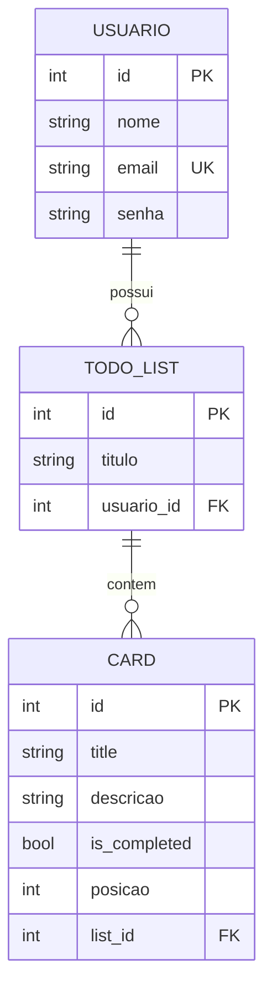
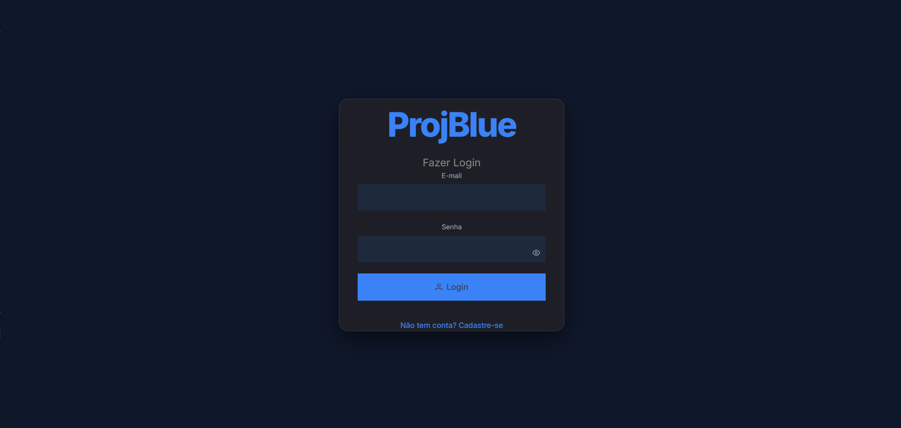
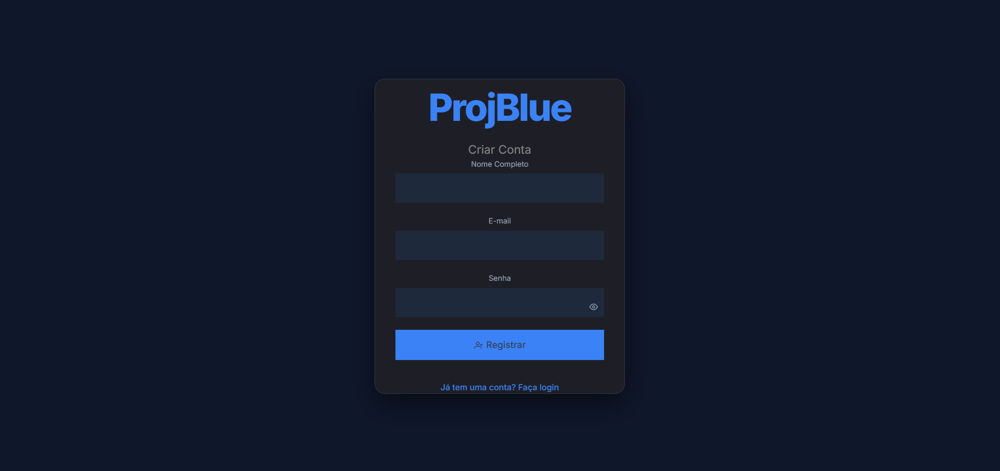
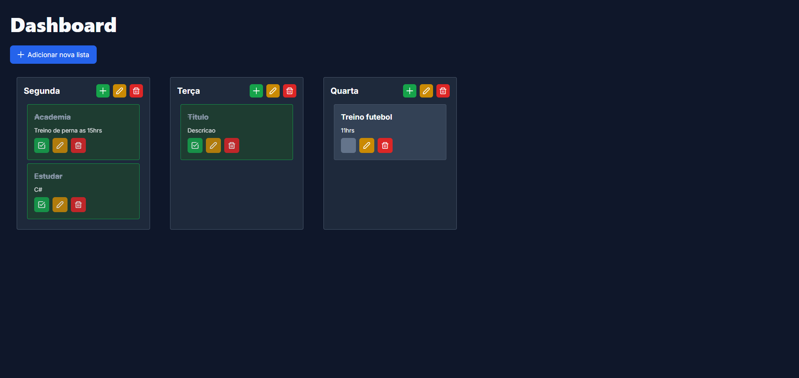

# ProjBlue 
Este projeto é um teste prático desenvolvido para demonstrar competências, focando em boas práticas, arquitetura escalável e conteinerização. A aplicação consiste em um gerenciador de tarefas (To-Do List) funcional, com autenticação e persistência de dados.

  - **Nota de Desenvolvimento:** Optei por manter alguns endpoints e arquivos remanescentes (como os de gerenciamento de usuários expandido) que faziam parte da ideia inicial. Decidi mantê-los para evidenciar o processo evolutivo do pensamento arquitetural durante o desenvolvimento, sem comprometer a estabilidade da entrega final.

## 🏗️ Arquitetura e Tecnologias
**Fluxo de Dados**
A aplicação utiliza uma estrutura robusta de comunicação:
 - Frontend (Vue.js) ➔ Nginx (Reverse Proxy) ➔ Backend (.NET Core) ➔ MySQL Database.

**Backend (.NET 8.0)**
Construído com uma arquitetura em camadas (Controller -> Service -> Repository), garantindo o desacoplamento e a testabilidade do código.
- Framework: .NET 8.0.
- ORM: Entity Framework Core com FluentAPI para mapeamento detalhado de entidades.
- Banco de Dados: MySQL.
- Segurança: Autenticação baseada em JWT (JSON Web Tokens) e criptografia de senhas com BCrypt.Net.
- Mapeamento: AutoMapper para conversão entre modelos de domínio e DTOs.
- Documentação: Swagger/OpenAPI configurado para testes de endpoints.

**Frontend (Vue 3)**
- Interface moderna e responsiva focada na experiência do usuário.
- Linguagem: TypeScript (TS).
- Framework: Vue.js 3 com a Composition API (Composables).
- UI: PrimeVue e Tailwind CSS para componentes estilizados e layout flexível.
- Comunicação: Axios para consumo da API REST.

## 📂 Estrutura de Pastas
```Plaintext
/backend
├── Controllers/    # Endpoints da API
├── Data/           # Contexto do EF e Configurações FluentAPI
├── DTOs/           # Objetos de transferência de dados (Request/Response)
├── Mappings/       # Perfis de mapeamento do AutoMapper
├── Migrations/     # Histórico de versões do banco de dados
├── Models/         # Entidades de domínio
├── Repository/     # Interfaces e Implementação de persistência
├── Services/       # Regras de negócio e lógica da aplicação
└── Program.cs      # Configuração da Injeção de Dependência e Pipeline

/frontend
├── src
│   ├── components/ # Componentes reutilizáveis (Card, TodoList, etc.)
│   ├── composables/# Lógica de estado compartilhada (useAuth, useCards)
│   ├── router/     # Configuração de rotas e guardas de navegação
│   ├── services/   # Integração com a API (Axios instances)
│   └── views/      # Páginas principais (Login, Cadastro, Dashboard)
```

## 📊 Esquema do Banco de Dados (UML/ER)


## 🖼️ Preview da Aplicação
Adicione este bloco logo após a descrição das tecnologias ou antes do guia de "Como Executar":

## 📸 Demonstração

| Login | Cadastro |
| :---: | :---: |
|  |  |

### Dashboard Principal


## 🚀 Como Executar
O projeto está totalmente dockerizado, o que facilita a execução em qualquer ambiente.

**Pré-requisitos**
- Git
- Docker 

**Passo a Passo**
**1. Clone o repositório:**

```Bash
git clone https://github.com/G4brielV/ProjetoTestBlue.git
cd ProjetoTestBlue
```

**2. Suba os containers:**
```Bash
docker-compose up -d --build
```

**URLs de Acesso**
 - Frontend: http://localhost:5173/ (Interface do usuário).
 - Swagger (Backend): http://localhost:5029/swagger/index.html (Documentação da API).
 - PhpMyAdmin: http://localhost:8081/ (Gerenciamento do banco MySQL).

**Credenciais de Teste**
Para facilitar a avaliação, o banco é iniciado com um usuário padrão:
- E-mail: teste@example.com
- Senha: teste123

(Ou sinta-se à vontade para criar uma nova conta na tela de cadastro).

